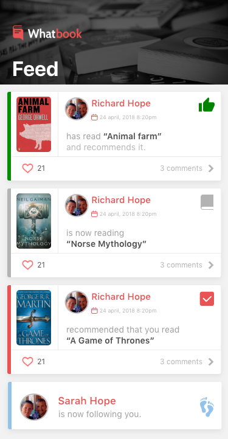

 
# Technical-Test (Android)
This is the repo for the technical test(Android)for Whatbook.




## Task

The above image is representative of the 'Feed' page within the Whatbook app.
Your task is to replicate this to the best of your ability.
Some graphic assets have been included in this repository to aid you in the design.

You will need to make a Network request for the feed items to populate the table (as above) The URL's and associated html header key values are listed below.
Please bear in mind that the request retrieves the first 10 'Feed' items and then gives the url for the subsequent page of items. You are to create a method of pulling this extra data on demand (when the table scrolls).
You are to persist the data to the device so that offline browsing can occur.

Network request URL is as follows:

```java
http://ec2-34-253-186-162.eu-west-1.compute.amazonaws.com/api/v1/feed/?
```
http header key values

```java
Key: Authorization
Value: Token 344dcc947ac5c258e4354bbf7182a70ed8ac4904
```
The request returns JSON, this needs to parsed, saved to disk and then displayed in order (using the 'created_at' value from the JSON) of most recent at the top of the feed.

## Demonstrate

Whilst you have been given an example of the layout of the feed, we are aware that not all graphical assets for the feed have been provided. We want to see how you as an individual can obtain, cultivate and present the feed as best you can.

## Coding language

We would prefer the challenge to be done using the Kotlin language for the following reasons:
Because Kotlin has several features which even modern versions of Java lack.

* Kotlin support best features of functional programming and OO programming language.
* Kotlin handles Null Pointer Exceptions easily.
* Kotlin support lambdas, higher order functions, smart casting.
* Approximately 40 % less number of code lines as compared to Java.

However, if Kotlin is a language you are not yet familiar with please use an alternative but explain the reasons for doing so.
We really would like to see Kotlin used so please try.
